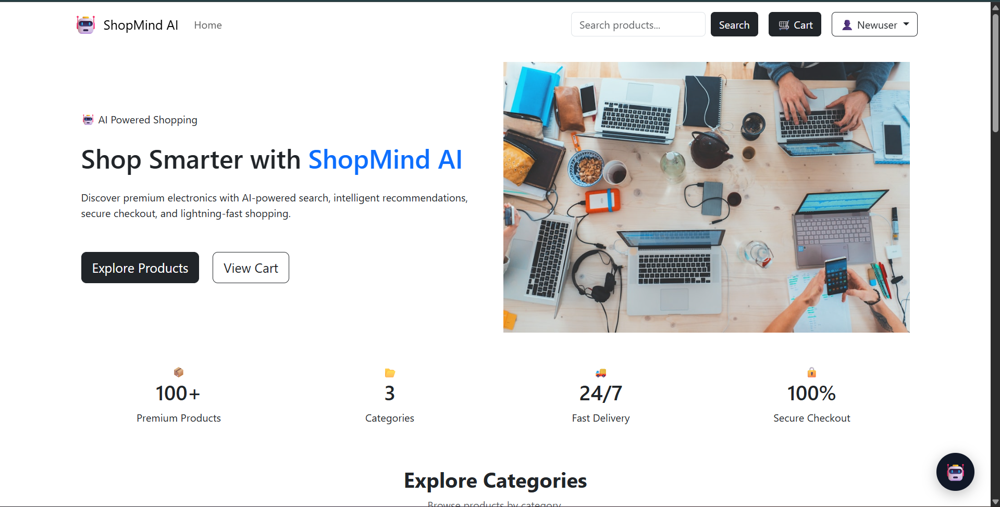
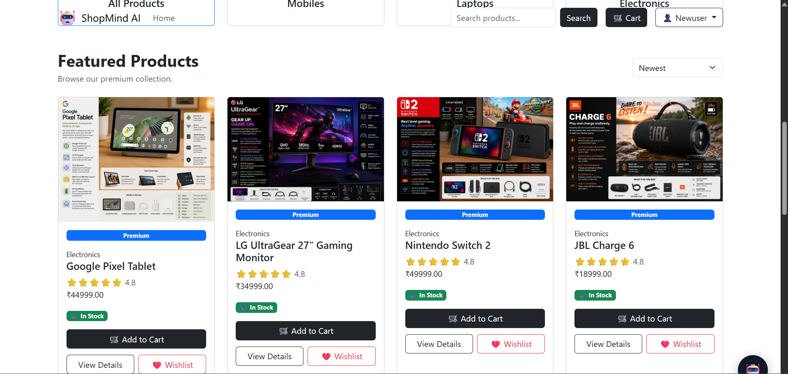
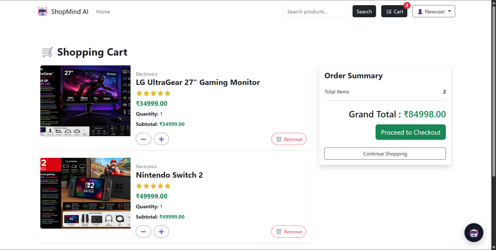

# 🛍️ ShopMind AI

ShopMind AI is a full-stack e-commerce web application built with **Python, Django, PostgreSQL, Cloudinary, and Groq AI**.

The application allows users to browse products, search products, manage their cart and wishlist, place orders, and interact with an AI shopping assistant that recommends products based on customer requirements, budget, category, and available stock.

---

## 🚀 Live Demo

🌐 **Live Website:**

https://shopmind-ai-ykfq.onrender.com

---

## 📂 GitHub Repository

💻 **Source Code:**

https://github.com/CHANDUBALAGANI/shopmind-ai

---

## ✨ Features

### 👤 User Authentication

- User registration
- User login
- User logout
- Django authentication
- User-specific orders
- Protected checkout

### 🛍️ Product Management

- Product categories
- Product listings
- Product descriptions
- Product prices
- Product stock management
- Product images
- Product search
- Category-based browsing

### 🛒 Shopping Cart

- Add products to cart
- Update product quantity
- Remove products
- Calculate product subtotal
- Calculate cart total
- Stock-aware cart functionality

### ❤️ Wishlist

- Add products to wishlist
- Remove products from wishlist
- View saved products

### 📦 Checkout & Orders

- Checkout form
- Customer information
- Order creation
- Order items
- Order total calculation
- Automatic stock reduction
- Order history
- Order details
- Order status

### 🤖 AI Shopping Assistant

ShopMind AI includes a basic AI-powered shopping assistant using **Groq API**.

The assistant can understand simple shopping requests and recommend products from the available store inventory.

### Example Questions

```text
I want a mobile
```

```text
I need a laptop under 80000
```

```text
Show me electronics
```

```text
Which mobile is under 50000?
```

---

## 🛠️ Technologies Used

### Backend

- Python
- Django
- Django ORM

### Frontend

- HTML5
- CSS3
- JavaScript
- Bootstrap

### Database

- PostgreSQL
- Neon PostgreSQL

### AI

- Groq API

### Image Storage

- Cloudinary
- Django Cloudinary Storage

### Deployment

- Render

### Development Tools

- Git
- GitHub
- Visual Studio Code

---

## ⚙️ Local Setup

Follow these steps to run ShopMind AI locally.

### 1. Clone the Repository

```bash
git clone https://github.com/CHANDUBALAGANI/shopmind-ai.git
cd shopmind-ai
```

### 2. Create and Activate a Virtual Environment

Create the virtual environment:

```bash
python -m venv .venv
```

Activate it on Windows PowerShell:

```powershell
.\.venv\Scripts\Activate.ps1
```

After activation, you should see:

```text
(.venv)
```

at the beginning of your terminal.

### 3. Install Dependencies

```bash
pip install -r requirements.txt
```

### 4. Configure Environment Variables

Create a `.env` file in the project root.

Example:

```env
SECRET_KEY=your-secret-key
DEBUG=True
DATABASE_URL=your-database-url
GROQ_API_KEY=your-groq-api-key
CLOUDINARY_CLOUD_NAME=your-cloud-name
CLOUDINARY_API_KEY=your-cloudinary-api-key
CLOUDINARY_API_SECRET=your-cloudinary-api-secret
```

> ⚠️ Never commit the `.env` file or API keys to GitHub.

### 5. Run Database Migrations

```bash
python manage.py migrate
```

### 6. Start the Development Server

```bash
python manage.py runserver
```

Open the application in your browser:

```text
http://127.0.0.1:8000/
```

---

## 📸 Screenshots

### 🏠 Home Page



### 🛍️ Products



### 🛒 Shopping Cart



### 🤖 AI Shopping Assistant


---

## ☁️ Deployment

ShopMind AI is deployed using **Render**.

### Production Services

| Service | Purpose |
|---|---|
| Render | Django application hosting |
| Neon PostgreSQL | Production database |
| Cloudinary | Product image storage |
| Groq | AI shopping assistant |

### Production Environment

The production application uses:

```text
DEBUG=False
```

Sensitive credentials are configured through Render environment variables.

---

## 🗄️ Database

ShopMind AI uses **PostgreSQL** for production.

The application uses Django ORM to manage:

- Users
- Categories
- Products
- Cart
- Cart Items
- Wishlist
- Orders
- Order Items

---

## 🖼️ Cloudinary Image Storage

Product images are stored using **Cloudinary**.

Cloudinary provides cloud-based image storage for product images used by the deployed application.

---

## 🤖 AI Shopping Workflow

```text
User Question
      │
      ▼
AI Shopping Assistant
      │
      ▼
Understand User Requirement
      │
      ▼
Check Available Products
      │
      ▼
Filter by Category / Budget / Availability
      │
      ▼
Generate AI Response
      │
      ▼
Product Recommendation
```

---

## 🧪 Testing

The application has been tested for:

- User registration
- User login
- Product browsing
- Product search
- Product images
- Shopping cart
- Wishlist
- Checkout
- Order creation
- Product stock updates
- Order history
- PostgreSQL connectivity
- Cloudinary image storage
- AI assistant
- Render deployment

---

## 🔮 Future Improvements

- 💳 Online payment integration
- ⭐ Product reviews and ratings
- 📦 Advanced order tracking
- 📧 Email notifications
- 🧠 Personalized AI recommendations
- 📊 Admin analytics dashboard
- 🔍 Advanced product filtering
- 💬 Improved conversational AI
- 📱 Progressive Web App support

---

## 📚 What I Learned

Through this project, I gained practical experience with:

- Django application development
- Django ORM and database relationships
- PostgreSQL database integration
- User authentication
- Shopping cart and checkout logic
- Order management
- Cloudinary image storage
- AI API integration
- Environment variable management
- Git and GitHub
- Production deployment using Render
- Debugging production issues

---

## 👨‍💻 Author

### Chandu Balagani

Computer Science graduate interested in:

- Python
- Django
- Backend Development
- PostgreSQL
- Web Development
- AI Applications

### GitHub

https://github.com/CHANDUBALAGANI

### LinkedIn

https://www.linkedin.com/in/chandu-balagani

---

## 🔗 Project Links

### 🌐 Live Demo

https://shopmind-ai-ykfq.onrender.com

### 💻 GitHub Repository

https://github.com/CHANDUBALAGANI/shopmind-ai

---

## 📄 License

This project was developed for educational and portfolio purposes.